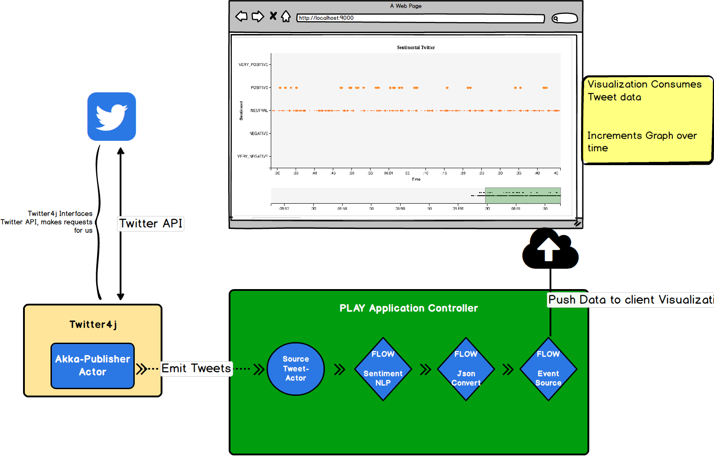

# CS 474: Final Project

### Authors
+ Kyle Almryde
+ Abhishek Tripanthi
+ Mike McClory

#### Preamble

This README documents the installation and usage for the cs474 Final Project tasked with developing a streaming pipeline application.

### What is this repository for? ###

Using the [Scala language](http://www.scala-lang.org/), [Akka](https://akka.io), [Play Framework](https://www.playframework.com/), 
[Twitter4j](https://github.com/yusuke/twitter4j), and [D3](https://d3js.org/), this application streams randomly sampled 
Twitter data through a Naturaly Language Processing Sentiment Classifier and displays the results on a dynamically 
updating chart via a web browser.  

### Libraries
* [Scala language](http://www.scala-lang.org/) was the core application language 
* [Akka](https://akka.io) was used for the Actor system and data Streaming 
* [Play Framework](https://www.playframework.com/) was used for the web server which passed the streamed data to a web client
* [twitter4j](https://github.com/yusuke/twitter4j) was used to interface with the Twitter API for streaming Tweets
* [D3](https://d3js.org/) was utilized for developing the data visualization of the oncoming stream

### How do I get set up?
To run the application, navigate to the root level of the project
```
cd kyle_mike_abhishek_finalproject/
sbt run
```
Give it a minute to load then a web browser will open. If not, open your browser and point it at http://localhost:9000/ or just [click here](http://localhost:9000/) 

###Full Disclosure
If you have a poor internet connection, you are going to have a bad time. Dont let ComCast get you down!
Joking aside, this app requires a solid internet connection in order to do its job. The app may not shutdown in some cases...

Another note, Please give it some time b

####Setting up from IntelliJ ####

1) If no project is currently open in IntelliJ IDEA, click **Import Project** on the Welcome screen. Otherwise, select **File | New | Project from Existing Sources**.

2) In the dialog that opens, select the directory that contains the project to be imported, or a file that contains an appropriate project description. Click **OK**.

3) On the first page of the **Import Project** wizard, select SBT, and click **Next**. (This page is not shown if IntelliJ IDEA has guessed what you are importing.)

4) On the next page of the wizard, specify SBT project settings and global SBT settings, click **Finish**.

#### Unit Testing
For Unit-testing I utilized Akka's Actor Testkit[ScalaTest](http://www.scalatest.orge) using the [FunSuite](http://doc.scalatest.org/3.0.0/#org.scalatest.FunSuite). Its fun and was surprisingly simple to get it up and running. The Akka Testkit was no walk in the park though, so forgive the stupid simple tests.

Go figure.

To run the tests, in Intellij simplly select the **SBT** task "Test" and youll be up and running! Que sera


## Discussion:
This project turned out to be particularly challenging in a large part due to the way Twitter4j handles the data streams.
That is, it uses the Listener/Callback model for handling incoming streams from Twitter, which acts in direct conflict with 
the Reactive Streaming model that Akka incorporates. 

##### Generating a Source 
To get around this, I utilized a hybrid actor model wherein I create a specially designed Actor to act as a 
'Publisher Source'. What this means is the actor sits inside of the Callback function and emits the incoming tweets as 
they arrive. The advantage of this approach is it let me process those tweets in whatever way I wanted to right away. 
From that point the pipeline is pretty standard Akka streaming approach. it incorporates a largely old school 
Listener/Callback Model which, while great in the conventional sense, proves tricky once you start trying to integrate 
it into a reactive model something like Akka's streaming library. 

##### Going with the Flow
Once our Source is generated, it was pretty straight forward to implement the nodes within Flow Graph. For my purposes,
I only include 1 Flow junction, which is used to perform the sentiment analysis. The benefits of doing it the way I did
was it automagically handles backpressue from the system. 

##### Integrating with Play
Truly this was the most challenging part of the entire project. I am at once immensely proud that I was able to get it 
working at all and more than a little frustrated with just how complicated and (ultimately) limited it ended up being. 


##### Towards the Data Visualization
The go-to for web-based Data visualization is without a doubt [D3](). 
I also took some help from a REALLY nice library that setup the pretty chart for me. [RealTimeChartMulti](https://bl.ocks.org/boeric/6a83de20f780b42fadb9)

##### Limitations 
Despite the many triumphs, this project is not perfect (are they ever?). As I discussed above, it was immensely challenging 
getting the twitter API to properly communicate with the Akka Streaming model. Following that step, communcating with the
browser was equally obnoxious to say the least. 

+ **Dynamic Querying**: Unfortuantely I was unable to get the querying to work on a dynamic scale. That is to say, the 
aplication streams in a Sample of the twitter stream, which is admittedly a lot of data, but it would have been more 
   interesting if we could modify the kind of tweets that come in
   
+ **Sentiment Analysis**: For all intents and purposes the Sentiment Analysis works, and within the framework of the 

### Streaming Model
I designed the Actor Model in the following way. The basic idea here is that each
step in the pipeline is controlled by and actor. Actions like Invoking the Github
API or generating the Patch and Understand Dependency graph each got their own actor.
My aim was to encapsulate as much of the task within the particular actor as I could
manage. For actions that invoked the system shell I created a separate 'Process Actor'.
For my purposes there was only one Github actor, it performed the query, and piped the results
back to the overseeing master actor, who then distributed the resulting json blobs to a dedicated
repository manager actor. This actor was responsible for overseeing the generation of the Understand database,
Patch file, and eventually composing and joining both of those pieces of information. Finally, it takes this
composition, generates a report, and sends THAT to the Master actor whom is overseeing all of these child
Repository actors, prints the results to Standard output, then shuts down the repository (deleting the contents of
the folder as well). It aint perfect by any measure of the word, but it works **mostly**



### Who do I talk to? ###

* If you have any specific questions contact me via [kyle.almryde@gmail.com](mailto:kyle.almryde@gmail.com)
* If you have any complaints, please direct them to this [Handsome devil](mailto:drmark@uic.edu)


